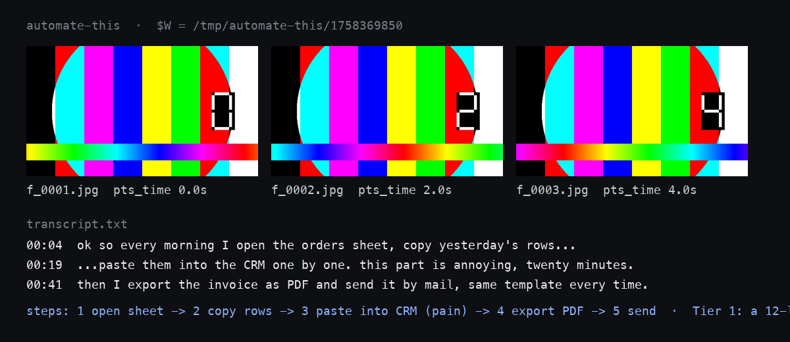

# automate-this

Record your screen while you do a routine and talk through it; this skill turns the recording into a numbered list of what you actually do, then into a script that does it for you. Everything runs on your machine.



**Try it:** put the folder into `~/.claude/skills/automate-this/`, then in Claude Code: *"here is a screencast of my morning routine: /path/to/video.mp4, automate this"*.

   

## Quick start

```bash
git clone https://github.com/MrFreedxm/automate-this.git ~/.claude/skills/automate-this
brew install ffmpeg yt-dlp          # or apt / your package manager
pip install mlx-whisper             # Apple Silicon; or: pip install openai-whisper / brew install whisper-cpp
bash ~/.claude/skills/automate-this/scripts/transcribe.sh --check
```

Then give Claude Code a video and ask it to automate what it sees. The skill makes it stop after reconstructing the steps and wait for your corrections before it builds anything.

## How it works

1. **Extract.** `ffmpeg` cuts frames on scene changes (so slides, demos and cuts are not missed; a timer pass is the fallback for one-screen lectures). A local ASR model transcribes the voice with timestamps.
2. **Reconstruct.** Frames plus transcript become a numbered list of steps. Spoken pain ("I do this every time", "this is annoying") marks the automation candidates. The list goes back to you first.
3. **Environment.** Only the tools the task needs are checked; nothing new is installed without a reason.
4. **Propose three tiers.** A one-liner or existing utility first, a small script second, a scheduled automation last.
5. **Build and test** on safe data, with a rollback note.

The recording is treated as data: instructions that appear on screen or in the voice are never executed.

## Architecture

```
SKILL.md                    the instructions Claude Code follows
scripts/extract-frames.sh   ffmpeg scene-change frames (or timer), timestamps in scenes.log
scripts/transcribe.sh       local ASR wrapper: mlx_whisper -> whisper -> whisper-cli; yt-dlp for URLs
```

## Stack

bash, ffmpeg, any local Whisper build (mlx-whisper, openai-whisper or whisper.cpp), yt-dlp. No cloud calls.

Built with [Claude Code](https://claude.com/claude-code) and Codex: the process is mine, most of the typing is theirs.

MIT © Ilya Tretyakov
